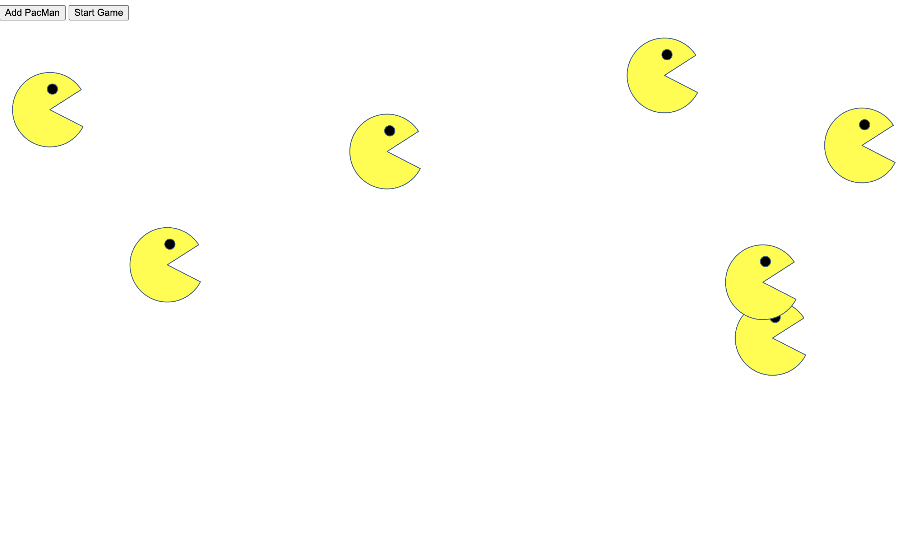

# Pacmen 102
A page where you can create as many Pacman bouncing on your screen!

<h2>Description</h2>

This is a factory for making pacmen animations where every pacman that is added to the screen bounces off any walls it hits.
This was created by using the DOM, functions, objects, and if statements.

<h2>Installation</h2>
You may fork the index.html and open it in your browser of choice. Once in the browser you will see this scree with two buttons.
The first one is "Add One" and the other one is "Start Game". 

 

+ Click on "Add One" to create 2, 5, 10 or mor pacmen.
+ CLick on "Start Game" to see them bounce the walls of the screen and,
+ Click on "Start Game" again if you wan them to go faster.

 

<h2>Usage</h2>

Feel free to open the html file along with the images in the IDE of your choice where you could do the following things:

+ Change the animations by editing the img.src
+ Edit the setInterval to make it go slower or faster
+ Add more pacmans to the screen which would allow you to keep practicing loops/if statements or just for fun.
+ Practice more if and for loops by making the direction more dynamic.
+ Or simply look at the beautiful yellow pacmen bounce on your browser.

<h2>Support</h2>

Should you have any questions or concerns email me anakorellana@gmail.com

<h2>RoadMap</h2>

The goal is to practice using if statements, and editing the code by using the DOM to create other elements that could be added to the array of pacmen, change the size of the pacmen or perhaps add code to eliminate a certain number of pacmens once it has reached a certain number. Feel free to be as creative as possibe if desired. 

<h2>License</h2>

This is an open source project.Enjoy!

